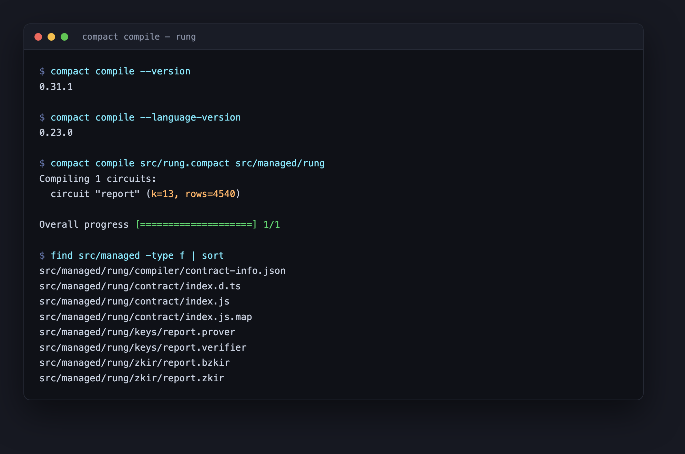
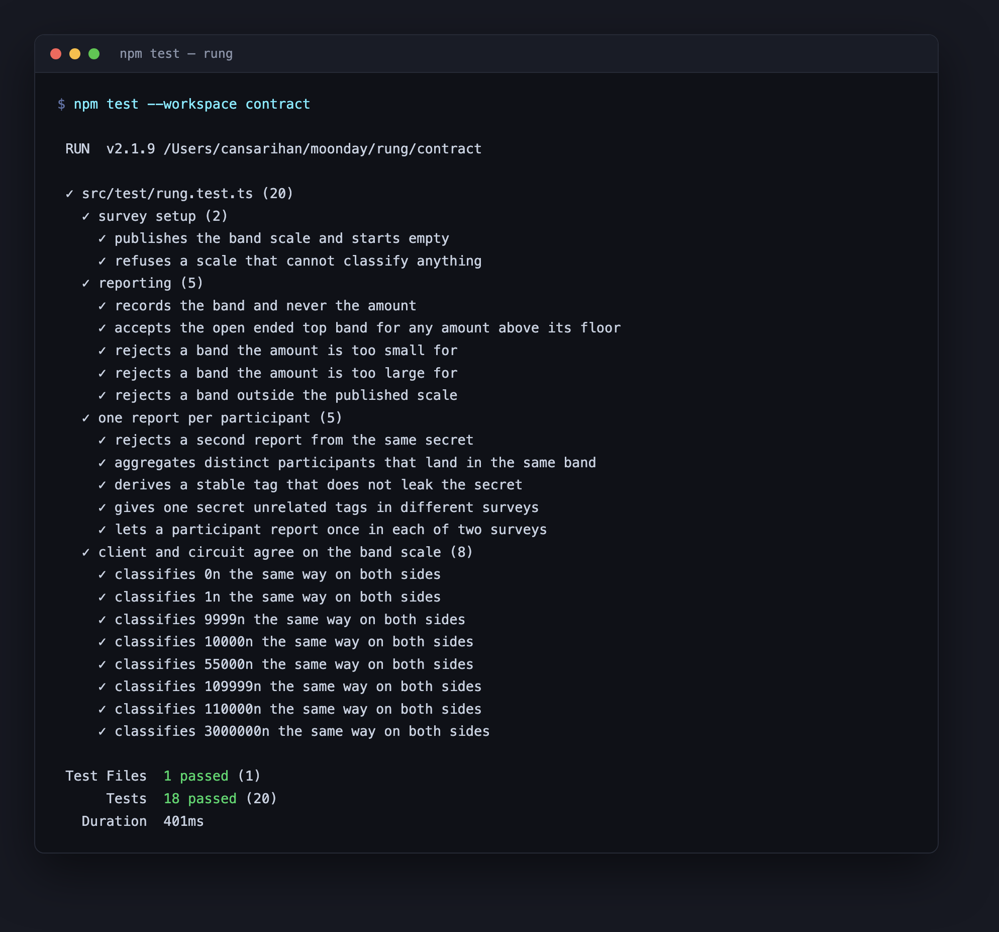
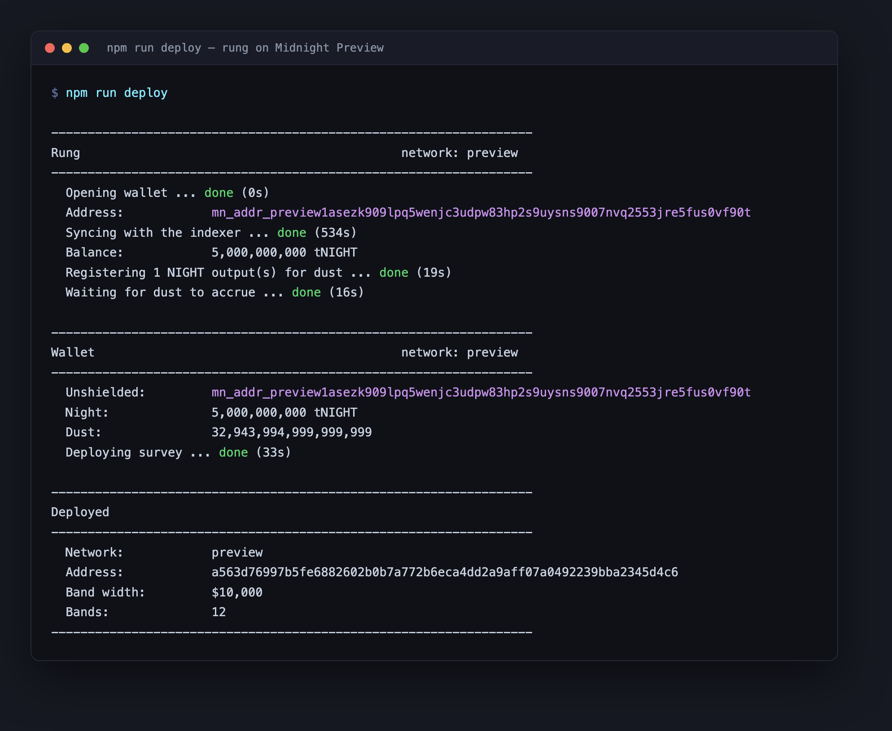

# Rung

A compensation survey that never learns anyone's compensation.

Rung is built on [Midnight](https://midnight.network). Participants prove, in zero
knowledge, that their pay falls inside the band they are reporting and that they
have not reported before. The ledger stores the resulting distribution. It never
stores a salary.

**[rung-midnight.vercel.app](https://rung-midnight.vercel.app)** — live client, on Preview.

## The idea

Compensation is the textbook case of information that is valuable in aggregate and
unpublishable individually. Employees negotiate against a number they cannot see,
while the surveys that do exist are either self-reported and unverifiable or held
by consultancies that sell the results back to the companies that supplied them.
Rung separates the two halves. The distribution is public and auditable by anyone;
the individual figure never leaves the machine it was typed on. A participant
submits a proof that their pay sits inside a particular band and that the secret
behind the submission has not been used before, and the chain learns exactly one
new fact: that one more distinct person landed in that band. The survey everyone
wants becomes possible precisely because nobody has to disclose anything.

## What the contract enforces

A report is accepted only when all of the following hold inside the circuit:

- The reported band is one the survey published.
- The private amount is at or above that band's floor.
- The private amount is below the next band's floor, unless the band is the
  highest one, which is open ended by design.
- The tag derived from the participant's secret has not been seen before.

Nothing about the amount is revealed by satisfying these constraints beyond the
band itself, which is the fact the survey exists to collect.

## Public state and private witness

Compact treats every value as private until the program says otherwise. A value
becomes public only when it crosses into a public domain — written to the ledger,
returned from an exported circuit, or passed to another contract — and the
compiler refuses to let it cross without an explicit `disclose()`. `disclose()`
does not encrypt or protect anything; it is the developer asserting that this
particular value is safe to publish.

**Private (witnesses).** Supplied by the participant's own process, consumed by
the proof, never transmitted:

| Witness                  | Type        | What it holds                        |
| ------------------------ | ----------- | ------------------------------------ |
| `participantSecret()`    | `Bytes<32>` | The participant's long lived secret  |
| `reportedCompensation()` | `Uint<64>`  | Annual gross pay                     |

**Public (ledger).** Written on chain, readable by anyone:

| Ledger field  | Type                      | What it holds                           |
| ------------- | ------------------------- | --------------------------------------- |
| `bandWidth`   | `Uint<64>`                | Width of one band, so clients agree      |
| `bandCount`   | `Uint<8>`                 | Number of bands; the last is open ended  |
| `surveyNonce` | `Bytes<32>`               | Scopes this survey's tags to itself      |
| `bandTotals`  | `Map<Uint<8>, Counter>`   | Reports per band                         |
| `spentTags`   | `Set<Bytes<32>>`          | One tag per participant                  |
| `reportCount` | `Counter`                 | Total accepted reports                   |

The `report` circuit discloses exactly two values, and both are deliberate:

- **The band.** Disclosed on the first line of the circuit, because publishing it
  is the entire purpose of the survey. Everything after that line compares the
  private amount against public band boundaries, so the comparison happens inside
  the proof and only its outcome — accept or reject — is observable.
- **The tag**, `persistentHash(["rung:tag:v1", surveyNonce, secret])`. Disclosed
  because rejecting a second report means checking membership of a public set.
  It is a preimage-resistant hash, so it identifies the *submission* without
  identifying the participant. The survey nonce is in the preimage deliberately:
  hashing the secret alone would give one person the same tag in every survey,
  and anyone holding two Rung ledgers could line the two up and follow that
  person between them. With the nonce, the same secret produces unrelated tags
  in every survey, and each survey still gets its one-report-per-participant
  guarantee.

The amount is never disclosed. It has no path to the ledger: it is read from a
witness, compared against two public bounds, and discarded when the circuit ends.

### What an observer can still infer

Being explicit about the edges matters more than claiming none exist. An observer
of the chain sees the band of every report, the order reports arrived in, and the
transaction that paid for each one. They do not see who reported or what anyone
earns beyond the band. A survey with very few participants leaks more than a large
one, because a band containing a single report identifies that person's range to
anyone who knows they took part.

Uniqueness is currently per secret, not per human: the contract guarantees that
one secret reports once, and a participant who controls two secrets can report
twice. Binding a secret to an eligible cohort — proving membership without
revealing which member — is the next piece of work, described under Roadmap.

## The browser client

The client is a static page. It holds no server of its own and keeps no account:
Lace supplies the indexer, the node and the proving service, and the page
supplies the circuit.

Reading and reporting are deliberately separated. The distribution is public, so
the ladder is drawn straight from the indexer with no wallet and no keys — a
visitor sees the survey in about two seconds. A wallet is needed only to add a
report, which is the only operation that produces a transaction.

### The privacy claim, made checkable

The claim is that a participant's pay is never disclosed, only its band. A claim
like that is easy to assert and hard to believe, so the client puts both halves
on screen while the amount is being typed, before anything is submitted:

| Stays on this device      | Goes to the chain                       |
| ------------------------- | --------------------------------------- |
| the amount                | the band index                          |
| the participant secret    | the tag, `hash(surveyNonce, secret)`    |
|                           | the proof that the two agree            |

Everything in the left column is read by the circuit and discarded when it
finishes. Everything in the right column is what the transaction carries, and it
is the same data the ladder is drawn from, so the published distribution can be
compared against the claim directly.

Two behaviours are worth watching for, because they are the claim in motion:

- Report an amount, then read the contract state from the indexer. The band
  count goes up by one. The amount appears nowhere, in any field, at any block.
- Report a second time from the same wallet. The circuit fails before a
  transaction is built, because the tag is already in `spentTags` — the contract
  recognises the repeat without ever having learned who the participant is.

Private state lives in memory for the lifetime of the tab. The participant
secret is the one exception: it is random, stored per wallet address in local
storage, and never transmitted. It has to be secret rather than derived from a
public key, because a tag anyone could recompute would let anyone test whether a
given person is in the survey, which is precisely the anonymity the tag exists
to protect.

## Repository layout

```
contract/
  src/rung.compact          the contract
  src/bands.ts              band arithmetic shared with clients
  src/witnesses.ts          private state and witness implementations
  src/managed/rung/         compiler output: circuits, proving and verifier keys
  src/test/                 contract tests against a simulated ledger
cli/
  src/main.ts               deploy, report and show commands
  src/wallet.ts             wallet, dust registration, provider wiring
  src/survey.ts             contract operations
web/
  src/lace.ts               wallet discovery, connect and disconnect
  src/survey.ts             providers, reading and reporting
  src/private-state.ts      in memory private state, participant secret
  src/App.tsx               the ladder and the disclosure panel
deployments/                one record per network
```

## Requirements

| Component         | Version  |
| ----------------- | -------- |
| Node.js           | 22 or newer |
| Compact toolchain | 0.31.1   |
| Compact language  | 0.23.0   |
| Compact runtime   | 0.16.0   |
| Midnight.js       | 4.1.1    |
| Proof server      | 8.1.0    |
| Docker            | any recent version |

These are the versions Preview, Preprod and Mainnet currently run. A newer
toolchain compiles against a newer ledger than the live networks accept, so the
version above is pinned rather than tracked.

`ledger-v8` and `compact-runtime` hand out classes backed by WebAssembly that are
compared by identity. A second copy of either anywhere in the dependency tree
makes a transaction built by one package unusable by another, with errors that
point nowhere near the cause. Both are therefore forced to a single version
through `overrides` in the root `package.json`.

## Running it locally

Install the Compact toolchain:

```bash
curl --proto '=https' --tlsv1.2 -LsSf \
  https://github.com/midnightntwrk/compact/releases/latest/download/compact-installer.sh | sh
source ~/.zshrc
compact update 0.31.1
compact compile --version    # 0.31.1
```

Install dependencies, compile the contract, build the packages and run the tests:

```bash
npm install
npm run compact
npm run build
npm test
```

`npm run compact` writes the circuits and keys to `contract/src/managed/rung`.
`npm run build` is not optional before using the CLI: the CLI imports the
contract as a package, so it resolves to `contract/dist`.



The circuit is reported as `k=13, rows=4575`: the proof system is sized for 8192
rows and the report circuit uses 4575 of them, most of it the hash and the set
membership check.



Start the proof server in its own terminal and leave it running:

```bash
npm run proof-server
```

Create a wallet seed and choose a network:

```bash
cp .env.example .env
# put a 32 byte hex seed in RUNG_WALLET_SEED, or leave it unset and the
# CLI will print a fresh one on first run
set -a && . ./.env && set +a
```

`RUNG_NETWORK` accepts `preview` or `preprod`. Addresses are network specific, so
a seed produces a different address on each, and the faucets are separate
services that go down independently of one another:

| Network | Faucet                                             | Health                                                    |
| ------- | -------------------------------------------------- | --------------------------------------------------------- |
| Preview | https://midnight-tmnight-preview.nethermind.dev/    | `/api/health` returns `SERVING` when it can dispense       |
| Preprod | https://midnight-tmnight-preprod.nethermind.dev/    | same endpoint                                              |

Deploy a survey. The CLI prints its unshielded address and waits there; fund that
address from the faucet for the network you chose, and it will register the
tokens for fee generation and carry on by itself.

```bash
npm run deploy
```

Report an amount into the deployed survey and read the distribution back:

```bash
npm run report -- --amount 82000
npm run show
```

`report` sends the band. It does not send `82000`.

## Deployment

A survey is live on Midnight Preview:

| | |
| ---------- | ------------------------------------------------------------------ |
| Network    | Preview                                                              |
| Address    | `a563d76997b5fe6882602b0b7a772b6eca4dd2a9aff07a0492239bba2345d4c6`   |
| Deploy tx  | `2cd0c1939d98f64bba141c1ec900b925c7c63771523a474ea7e64201100b3d8d`   |
| Block      | 964637, 2026-09-21T15:50:48Z                                         |
| Band width | $10,000                                                              |
| Bands      | 12, the highest open ended                                           |

`deployments/preview.json` holds the same record, including the survey nonce.

The deployment can be confirmed against the network rather than taken on trust:

```bash
curl -s -X POST https://indexer.preview.midnight.network/api/v4/graphql \
  -H 'content-type: application/json' \
  -d '{"query":"{ contractAction(address: \"a563d76997b5fe6882602b0b7a772b6eca4dd2a9aff07a0492239bba2345d4c6\") { __typename address ... on ContractDeploy { transaction { hash block { height timestamp } } } } }"}'
```

```json
{
  "data": {
    "contractAction": {
      "__typename": "ContractDeploy",
      "address": "a563d76997b5fe6882602b0b7a772b6eca4dd2a9aff07a0492239bba2345d4c6",
      "transaction": {
        "hash": "2cd0c1939d98f64bba141c1ec900b925c7c63771523a474ea7e64201100b3d8d",
        "block": { "height": 964637, "timestamp": 1790005848000 }
      }
    }
  }
}
```



Reading a survey back needs no wallet, only the indexer, so it returns in a
couple of seconds rather than waiting out a chain sync:

```
$ npm run show

  Address:            a563d76997b5fe6882602b0b7a772b6eca4dd2a9aff07a0492239bba2345d4c6

------------------------------------------------------------------
Survey                                          0 report(s)
------------------------------------------------------------------
  $0 to $9,999                                         0
  $10,000 to $19,999                                   0
  ...
  $110,000 and above                                   0
------------------------------------------------------------------
```

Preprod was the first target, but its faucet was answering
`{"status":"NOT_SERVING","reason":"SERVICES_DOWN"}` at the time, so the survey
went to Preview. Nothing but `RUNG_NETWORK` differs between the two.

## Roadmap

| Stage                | Work                                                                 |
| -------------------- | -------------------------------------------------------------------- |
| Contract and CLI     | Banded reporting, one report per secret, deployed and verifiable      |
| Web client           | Lace in the browser, reporting without a terminal                     |
| Eligible cohorts     | Prove membership of a cohort without revealing which member           |
| Richer aggregates    | Percentile boundaries over the distribution, still without amounts    |

## License

MIT. See [LICENSE](LICENSE).
